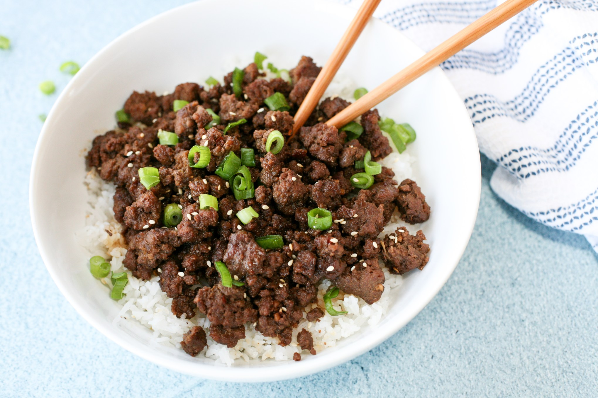

- Level: Easy
- Total: 30 min
- Prep: 10 min
- Cook: 20 min
- Yield: ~12 servings

## Ingredients

* 3 lb lean ground beef
* 9 garlic cloves minced or 3 tbsp minced garlic
* 6-9 tbsp brown sugar
* 3/4 cup soy sauce reduced sodium
* 6 tsp sesame oil
* 3/4 tsp ground ginger
* 3/4 tsp ground pepper
* 2 cups cooked rice
* green onions sliced, for garnish
* sesame seeds for garnish
* steamed vegetabls optional

## Directions

1. Cook the ground beef and garlic in a large skillet over medium heat until no longer pink. Drain grease as needed.

2. Whisk brown sugar, soy sauce, sesame oil, ginger and pepper together in a small bowl. Pour over the ground beef, stir to mix well and let simmer for two or three minutes.

3. Serve over cooked rice garnished with green onions and sesame seeds. Add steamed broccoli or other vegetable of choice if desired.

[Recipe Source](https://pinchofparsley.com/2018/02/26/korean-ground-beef/).
