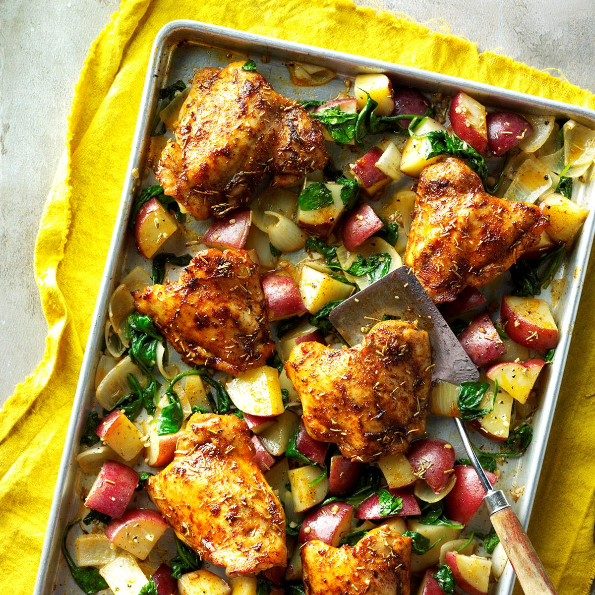

- Level: Easy
- Total: 60 min
- Prep: 15 min
- Cook: 45 min
- Yield: 6 servings

## Ingredients

* 2 pounds red potatoes (about 6 medium), cut into 3/4-inch pieces
* 1 large onion, coarsely chopped
* 2 tablespoons olive oil
* 3 garlic cloves, minced
* 1-1/4 teaspoons salt, divided
* 1 teaspoon dried rosemary, crushed, divided
* 3/4 teaspoon pepper, divided
* 1/2 teaspoon paprika
* 6 bone-in chicken thighs (about 2-1/4 pounds), skin removed
* 6 cups fresh baby spinach (about 6 ounces)

## Directions

1. Preheat oven to 425°. In a large bowl, combine potatoes, onion, oil, garlic, 3/4 teaspoon salt, 1/2 teaspoon rosemary and 1/2 teaspoon pepper; toss to coat. Transfer to a 15x10x1-in. baking pan coated with cooking spray.

2. In a small bowl, mix paprika and the remaining salt, rosemary and pepper. Sprinkle chicken with paprika mixture; arrange over vegetables. Roast until a thermometer inserted in chicken reads 170°-175° and vegetables are just tender, 35-40 minutes.

3. Remove chicken to a serving platter; keep warm. Top vegetables with spinach. Roast until vegetables are tender and spinach is wilted, 8-10 minutes longer. Stir vegetables to combine; serve with chicken.

[Recipe Source](https://www.tasteofhome.com/recipes/pan-roasted-chicken-and-vegetables/print/).
