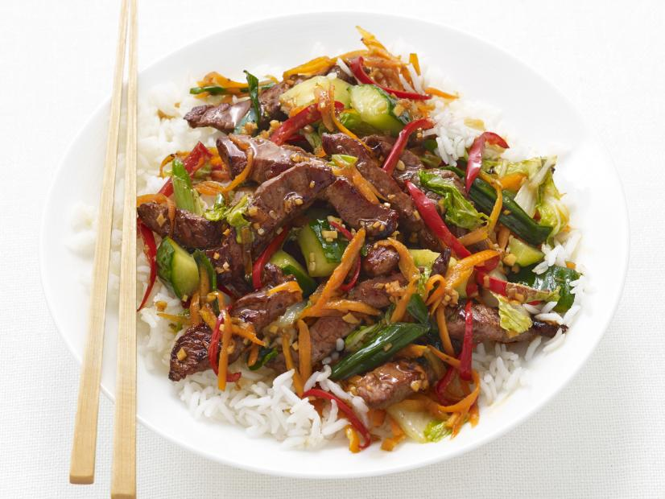

- Level: Easy
- Total: 35 min
- Prep: 20 min
- Cook: 15 min
- Yield: 4 servings

## Ingredients

* 2 tablespoons packed light brown sugar
* 2 tablespoons low sodium soy sauce
* 2 tablespoons cornstarch
* 2 tablespoons toasted sesame oil
* 8 ounces top round steak, thinly slice __against grain__
* 2 bunches scallions, cut into 1-inch pieces
* 1/2 english cucumber, quartered and cut into 1-inch pieces
* 1/2 head napa cabbage, cut into 1-inch-thick strips
* 1 cup shredded carrots (about 2)
* 1 tablespoon minced peeled ginger
* 2 red jalapeno peppers, halved, seeded and thinly sliced
* 3 cups cooked white rice, for serving

## Directions

1. Whisk the brown sugar, soy sauce, cornstarch, 2 tablespoons water and 2
teaspoons sesame oil in a bowl. Add the steak and toss.

2. Heat a large skillet over high heat; add 2 teaspoons sesame oil. Add the
scallions, cucumber and cabbage; stir-fry
until the vegetables start softening, about 2 minutes. Add the carrots and 1/4 cup water; cook, stirring, until the water evaporates and the vegetables are tender, 2 to 3 minutes. Transfer to a bowl; wipe out the skillet.

3. Heat the remaining 2 teaspoons sesame oil in the skillet over medium-high heat. Add the ginger and jalapenos; stir-fry 30 seconds. Transfer the steak to the skillet
using a slotted spoon; stir-fry until browned, 2 to 3 minutes.

4. Add the steak marinade back to the skillet and cook, stirring, until thick, about 2 minutes. Return the vegetables to the skillet and heat through. Serve over rice.

[Recipe Source](https://foodnetwork.com/recipes/food-network-kitchen/sesame-steak-stir-fry-3363229).
